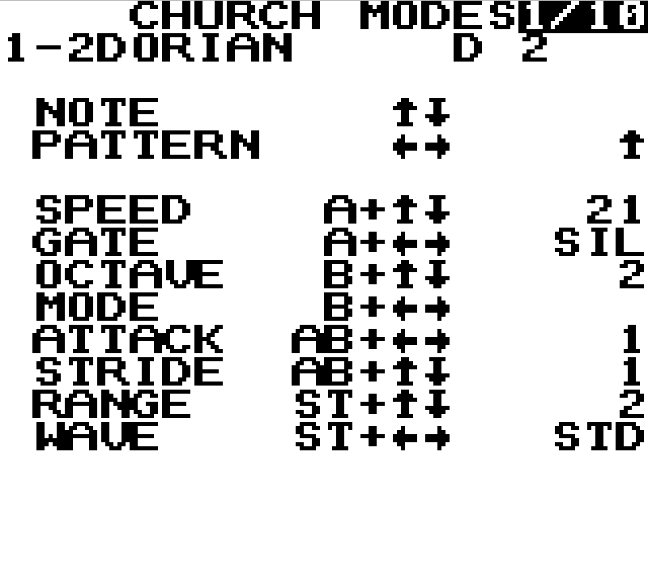
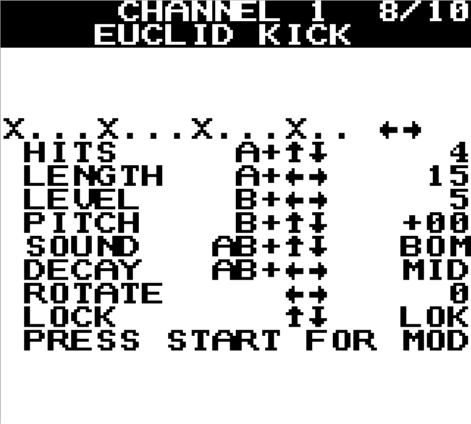
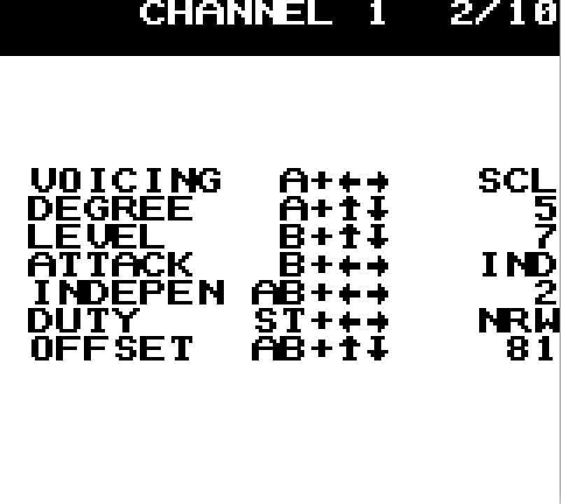

# DMGARP

A modal arpeggiator instrument for the original 1989 Nintendo GameBoy DMG,
written in RGBDS assembly, tuned for live performance. It runs as a
self-contained 32 KB ROM on real hardware or any accurate emulator.
Four sound channels, ten pages of live-editable parameters, 28 scale
banks spanning church modes, harmonic-minor modes, Messiaen modes,
and Ethiopian pentatonic scales. All parameters take effect
immediately — no menus to commit.

Aleksi Eeben, the author of GB Electric Drum, once answered my
request for source code with "It's a good practice. Go program it
yourself." With DMGARP I finally did it.

**[Download latest ROM (V37.1)](https://github.com/kennhartwig/dmgarp/releases/latest/download/dmg-arp.gb)**

---

## Features

### Scale system

28 banks organized in four families:

| Family | Banks |
|--------|-------|
| Church modes | Ionian, Dorian, Phrygian, Lydian, Mixolydian, Aeolian, Locrian |
| Harmonic minor modes | Harmonic Minor, Locrian ♮6, Ionian ♯5, Dorian ♯11, Phrygian Dominant, Lydian ♯2, Super Locrian |
| Messiaen modes | Whole Tone, Octatonic, and modes 3–7 |
| Ethiopian pentatonic | Tizita Maj/Min, Bati Maj/Min, Ambassel, Anchihoye, Yematibela |

### Arpeggiator engine

- 4 patterns: ascending, descending, ping-pong, random (LFSR)
- 32 logarithmic speed presets
- Tap tempo with subdivisions (1/1, 1/2, 1/3, 1/4) and 7 swing levels
- Root note C2–B6 (60 semitones), octave range 1–3, stride 1–4
- 5 gate modes: off, 75%, 50%, 25%, silence (CH2 only)

### Channel synthesis

**CH2 — main arpeggio voice**
4 square-wave duty cycles (STD/THN/LNG/NRW), attack envelope.

**CH1 — companion voice**
6 modes: OFF, OC+ (one octave above), OC− (one octave below), DET (detuned
unison), INT (fixed interval above the current arp note), SCL (diatonic scale
degree offset). Independent volume (0–7), 3-way attack (off / same as CH2 /
independent), duty cycle, signed step-delay OFFSET.

**CH3 — wavetable channel**
5 wavetable presets (SIN, SAW, TRI, ORG, BAS), 8 shape envelopes (PLK, DCY,
ATK, AD, TRM, GAT, RND, OFF), envelope rate, 3 volume levels. Mix mode layers
CH3 over CH2; Wave mode plays CH3 independently; Off silences it.

**CH4 — three drum subsystems**

- *ACCENT* — fires on arpeggio cycle start: KIK (CH1 sweep + CH4 layered),
  SNR, RIM.
- *FILL* — gate-noise burst between notes: level, color (HIS = 15-bit LFSR /
  MTL = 7-bit LFSR), pitch, frequency divider, and 5 volume curves (FLT, ER↑,
  ER↓, LR↑, LR↓). Volume curves are computed in software; each curve shapes
  the burst amplitude across the full arp cycle independently of the hardware
  envelope.
- *TONAL* — 7-bit LFSR shadow melody tracking or inverting the arp: mode,
  level, map (TRK/GML/INV), LFSR width, decay, transpose (±12 semitones),
  trigger density, and CH4 priority (ALL / +ACC / +FIL / SOLO).

### Euclidean kick drum

Bjorklund pattern generator running on CH1:

- Hits 1–16, pattern length 2–16, rotation offset
- 4 sweep timbres: TIGHT, BOOM, SUB, PUNCH
- 3 decay lengths: SHORT, MID, LONG
- Per-hit LFO modulation of kick pitch and kick velocity (shape, rate, depth
  each — shapes: OFF, UP, DN, TRI, SIN, RND)
- LOCK mode: LEN automatically tracks the arp cycle length

### Interface

- 10 pages, navigated with SELECT
- Help-row overlay: abbreviated values spell out in full for a short
  period after each change, then clear
- 8-slot battery save (MBC1+RAM+BATTERY); slots identified by random
  word names; two-press overwrite confirmation; successfully tested
  with GB USB Smart Card 64M
- WILD randomize (all parameters) and MILD randomize (keeps scale, root,
  octave, and tempo), with 8-level undo/redo history
- MIXER page: per-channel mute toggles (CH1/CH2/CH3/CH4, Euclidean kick)

---

## Screenshots





---

## Controls

SELECT navigates between pages. START + SELECT navigate pages in
reverse order. On the start screen, A+LEFT triggers a sound; START
enters the instrument.

---

## Build

Requirements: Linux (Ubuntu 20.04 LTS or compatible), `curl`, `tar`, `dpkg-deb`.

```bash
git clone https://github.com/kennhartwig/dmgarp.git
cd dmgarp
make setup      # download RGBDS v1.0.1 and mGBA 0.10.5 into tools/
make build      # assemble src/arpeggio.asm → roms/dmg-arp.gb
```

The toolchain is downloaded by `scripts/bootstrap-tools.sh` into the local
`tools/` directory. No global install is needed. `tools/` is gitignored.

`make setup` downloads a prebuilt mGBA 0.10.5 Ubuntu Focal package. On other
Linux distributions, install mGBA separately from
[mgba.io](https://mgba.io/downloads.html) and point the scripts at your
installation. `make build` only requires RGBDS and works on any Linux.

Build pipeline: `rgbasm` → `rgblink` →
`rgbfix -m 0x03 -r 2 -t DMGARP` (MBC1+RAM+BATTERY, 8 KB SRAM).

Additional targets:

```bash
make smoke      # headless boot test (requires mGBA)
make run        # launch in mGBA
make debug      # launch with mGBA debugger
make clean      # remove build/ and roms/dmg-arp.gb
```

The Euclidean pattern table (`src/euclid-table.inc`) is pre-generated and
committed. To regenerate it from scratch:
`python3 scripts/gen-euclid-table.py`.

---

## Run in emulator

Drag `roms/dmg-arp.gb` onto any of the following emulators. All are accurate
on the register level for the audio and video features DMGARP uses:

- [mGBA](https://mgba.io/) — cross-platform; used during development
- [BGB](https://bgb.bircd.org/) — Windows; excellent DMG accuracy
- [SameBoy](https://sameboy.github.io/) — macOS and Windows
- [Emulicious](https://emulicious.net/) — cross-platform, Java

mGBA keyboard defaults: A = Z, B = X, START = Enter, SELECT = Backspace,
D-pad = arrow keys. The included `config.ini` / `portable.ini` use a German
keyboard layout mapping.

SRAM persistence: mGBA saves SRAM to `roms/dmg-arp.sav` automatically. Your
parameter presets survive between sessions.

---

## Flash to cartridge

DMGARP should run on any compatible flash cartridge and has been
successfully tested on DMG hardware. The procedure below covers the
[EMS USB 64M Smart Card](http://www.emsfrom.com/) on Linux.

### Tool

Use the open-source `ems-flasher` CLI:
[github.com/mikeryan/ems-flasher](https://github.com/mikeryan/ems-flasher)

Three source patches are required to flash DMGARP as an auto-boot ROM (no
game-selection menu). A helper script automates the build:

```bash
./scripts/build-ems-flasher.sh
# Builds the patched binary at /tmp/ems-flasher/ems-flasher-real
# Note: /tmp is cleared on reboot — re-run the script each new session
```

System dependencies for the build: `git`, `gcc`, `make`, `libusb-1.0-0-dev`,
`build-essential`.

See [`docs/FLASHING.md`](docs/FLASHING.md) for the full procedure including
the udev rule for USB access, the three patch explanations, and the
write/verify commands.

---

## Author

Kenn Hartwig — [kennhartwig.de/instruments.html](https://kennhartwig.de/instruments.html)

---

## License

MIT — see [LICENSE](LICENSE).
